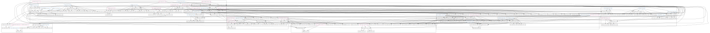
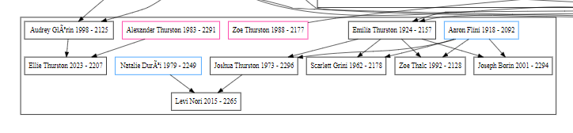

## Assignment 5

#### Use graphiz.py to create a family tree with first name, last name, birth date, and death date.

## Very ugly family tree of 7 clans and 6 generations

#### Expanded

#### GIF
 

|   #   | File                                         | Description                                  |
| :---: | -------------------------------------------- | -------------------------------------------- |
|   1   | [family_tree_data.csv](family_tree_data.csv) | [CSV of people data](family_tree_data.csv)   |
|   2   | [A04](graphviz.svg)                          | [Graph](graphviz.svg)                        |
|   3   | [zoomed.png](expandedgraph.png)              | [Zoomed in Graph](zoomed.png)                |
|   4   | [panograph.gif](panograph.gif)               | [panoramic gif of graph](panograph.gif)      |
|   5   | [family_tree.dot](family_tree.dot)           | [Graphviz Family Tree Code](family_tree.dot) |
|   6   | [main.py](main.py)                           | [Implementation](main.py)                    |