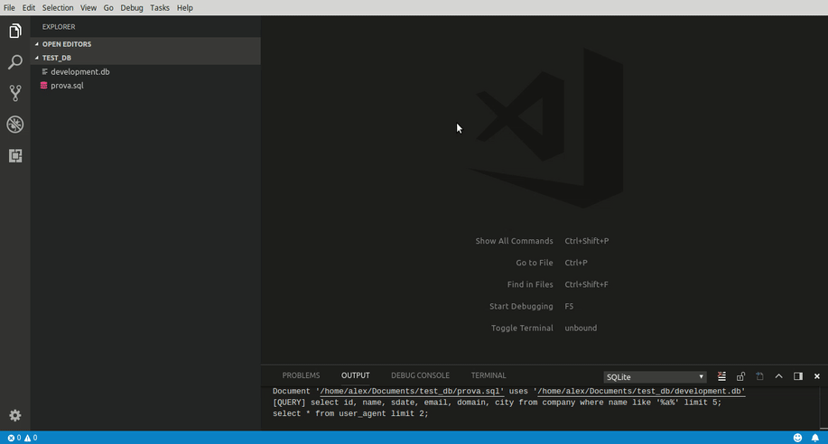

# [SQLITE](https://www.sqlite.org/index.html)

SQLite is a C-language library that implements a small, fast, self-contained, high-reliability, full-featured, SQL database engine. SQLite is the most used database engine in the world. SQLite is built into all mobile phones and most computers and comes bundled inside countless other applications that people use every day.

Great alternative to a cloud database when speed and cost is an issue.


Developers pledge to maintain support until at least 2050

Uses SQL commands

## Commands

SQLite python commmand structure:
con.execute("""COMMAND""")

Example: con.execute('SELECT * FROM bank')

| Command         | Function                         |
| --------------- | -------------------------------- |
| SELECT          | extracts data from a database    |
| UPDATE          | updates data in a database       |
| DELETE          | deletes data from a database     |
| INSERT INTO     | inserts new data into a database |
| CREATE DATABASE | creates a new database           |
| ALTER DATABASE  | modifies a database              |
| CREATE TABLE    | creates a new table              |
| ALTER TABLE     | modifies a table                 |
| DROP TABLE      | deletes a table                  |
| CREATE INDEX    | creates an index (search key)    |
| DROP INDEX      | deletes an index                 |

## Creating a database table
```
import sqlite3

conn = sqlite3.connect('test.db')
print("Opened database successfully")

conn.execute('''CREATE TABLE COMPANY
         (ID INT PRIMARY KEY     NOT NULL,
         NAME           TEXT    NOT NULL,
         AGE            INT     NOT NULL,
         ADDRESS        CHAR(50),
         SALARY         REAL);''')
print("Table created successfully")

conn.close()
```
## Connecting to a Database
```
import sqlite3

conn = sqlite3.connect('test.db')

print("Opened database successfully")
```
## Inserting data into a table
```
import sqlite3

conn = sqlite3.connect('test.db')
print "Opened database successfully";

conn.execute("INSERT INTO COMPANY (ID,NAME,AGE,ADDRESS,SALARY) \
      VALUES (1, 'Paul', 32, 'California', 20000.00 )");

conn.execute("INSERT INTO COMPANY (ID,NAME,AGE,ADDRESS,SALARY) \
      VALUES (2, 'Allen', 25, 'Texas', 15000.00 )");

conn.execute("INSERT INTO COMPANY (ID,NAME,AGE,ADDRESS,SALARY) \
      VALUES (3, 'Teddy', 23, 'Norway', 20000.00 )");

conn.execute("INSERT INTO COMPANY (ID,NAME,AGE,ADDRESS,SALARY) \
      VALUES (4, 'Mark', 25, 'Rich-Mond ', 65000.00 )");

conn.commit()
print("Records created successfully")
conn.close()
```

## Selecting data from table
```
import sqlite3

conn = sqlite3.connect('test.db')
print "Opened database successfully";

cursor = conn.execute("SELECT id, name, address, salary from COMPANY")
for row in cursor:
   print("ID = ", row[0])
   print ("NAME = ", row[1])
   print ("ADDRESS = ", row[2])
   print ("SALARY = ", row[3], "\n")

print("Operation done successfully")
conn.close()
```
## Results
```
Opened database successfully
ID = 1
NAME = Paul
ADDRESS = California
SALARY = 20000.0

ID = 2
NAME = Allen
ADDRESS = Texas
SALARY = 15000.0

ID = 3
NAME = Teddy
ADDRESS = Norway
SALARY = 20000.0

ID = 4
NAME = Mark
ADDRESS = Rich-Mond
SALARY = 65000.0

Operation done successfully
```

## SQLite VSCode Extension

[Github Repo](https://github.com/AlexCovizzi/vscode-sqlite)



* Provides visual respresentation of database tables
* Auto generates queries

## Python Commands (https://www.tutorialspoint.com/sqlite/sqlite_python.htm)
```
Sr.No.	API & Description
1	
sqlite3.connect(database [,timeout ,other optional arguments])

This API opens a connection to the SQLite database file. You can use ":memory:" to open a database connection to a database that resides in RAM instead of on disk. If database is opened successfully, it returns a connection object.

When a database is accessed by multiple connections, and one of the processes modifies the database, the SQLite database is locked until that transaction is committed. The timeout parameter specifies how long the connection should wait for the lock to go away until raising an exception. The default for the timeout parameter is 5.0 (five seconds).

If the given database name does not exist then this call will create the database. You can specify filename with the required path as well if you want to create a database anywhere else except in the current directory.

2	
connection.cursor([cursorClass])

This routine creates a cursor which will be used throughout of your database programming with Python. This method accepts a single optional parameter cursorClass. If supplied, this must be a custom cursor class that extends sqlite3.Cursor.

3	
cursor.execute(sql [, optional parameters])

This routine executes an SQL statement. The SQL statement may be parameterized (i. e. placeholders instead of SQL literals). The sqlite3 module supports two kinds of placeholders: question marks and named placeholders (named style).

For example − cursor.execute("insert into people values (?, ?)", (who, age))

4	
connection.execute(sql [, optional parameters])

This routine is a shortcut of the above execute method provided by the cursor object and it creates an intermediate cursor object by calling the cursor method, then calls the cursor's execute method with the parameters given.

5	
cursor.executemany(sql, seq_of_parameters)

This routine executes an SQL command against all parameter sequences or mappings found in the sequence sql.

6	
connection.executemany(sql[, parameters])

This routine is a shortcut that creates an intermediate cursor object by calling the cursor method, then calls the cursor.s executemany method with the parameters given.

7	
cursor.executescript(sql_script)

This routine executes multiple SQL statements at once provided in the form of script. It issues a COMMIT statement first, then executes the SQL script it gets as a parameter. All the SQL statements should be separated by a semi colon (;).

8	
connection.executescript(sql_script)

This routine is a shortcut that creates an intermediate cursor object by calling the cursor method, then calls the cursor's executescript method with the parameters given.

9	
connection.total_changes()

This routine returns the total number of database rows that have been modified, inserted, or deleted since the database connection was opened.

10	
connection.commit()

This method commits the current transaction. If you don't call this method, anything you did since the last call to commit() is not visible from other database connections.

11	
connection.rollback()

This method rolls back any changes to the database since the last call to commit().

12	
connection.close()

This method closes the database connection. Note that this does not automatically call commit(). If you just close your database connection without calling commit() first, your changes will be lost!

13	
cursor.fetchone()

This method fetches the next row of a query result set, returning a single sequence, or None when no more data is available.

14	
cursor.fetchmany([size = cursor.arraysize])

This routine fetches the next set of rows of a query result, returning a list. An empty list is returned when no more rows are available. The method tries to fetch as many rows as indicated by the size parameter.

15	
cursor.fetchall()

This routine fetches all (remaining) rows of a query result, returning a list. An empty list is returned when no rows are available.
```